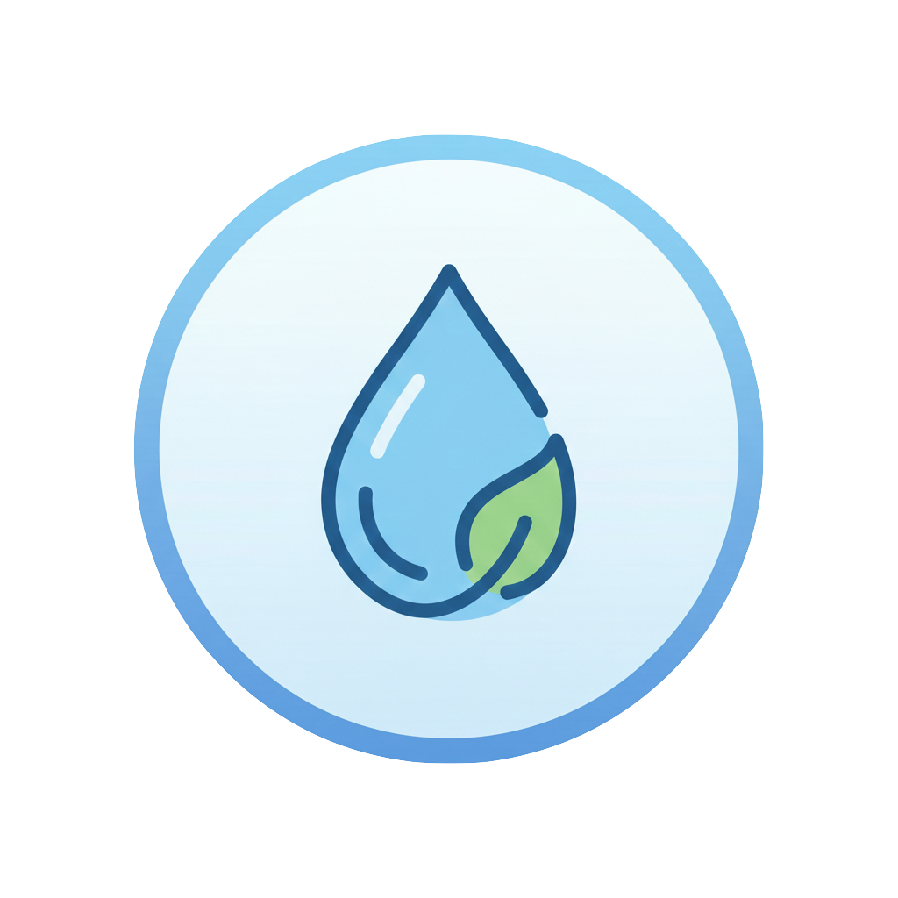
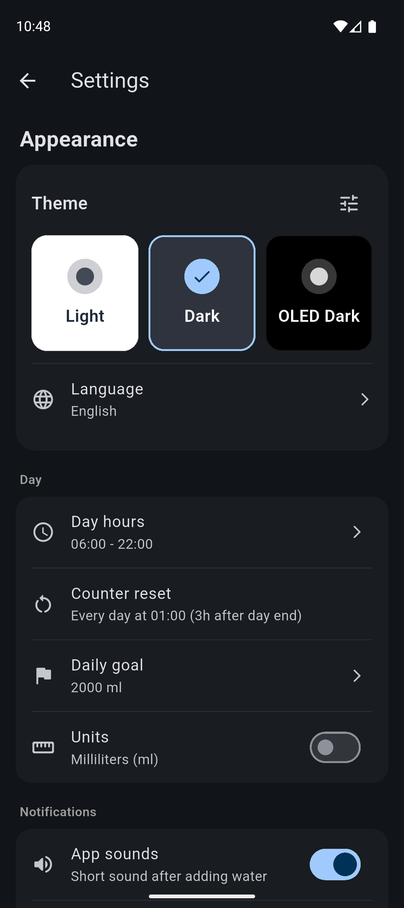

# Drink Water Tracker

	

A simple mobile app for tracking daily water intake, built with Flutter.

## About

This application helps you monitor your daily water consumption. It allows you to easily log the amount of water you drink and track your progress towards your daily hydration goals.

## Why I Created This App

I was frustrated with how simple water tracking apps in the Google Play Store and App Store are filled with intrusive ads and constant reminders to purchase expensive premium versions.

So I decided to build my own personal solution - a clean, ad-free app without any premium features or paywalls. Just pure functionality without any annoying interruptions.

## Project Status

This is the first version of the app. I plan to continue developing it and adding new features over time.

## Technology Stack

- Flutter
- Dart

## Screenshots

### Main

	
	
	

### Add Water

	

### Settings

	
	

### Statistics

	
	

	
	

